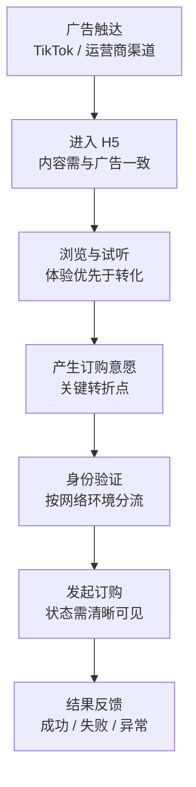
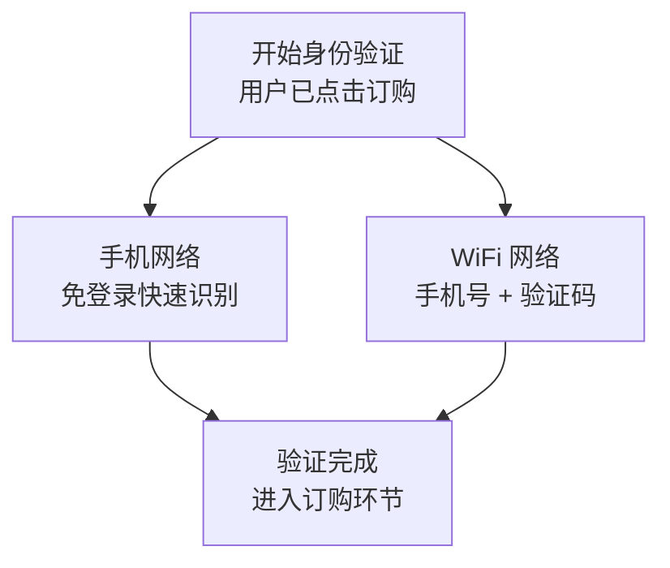
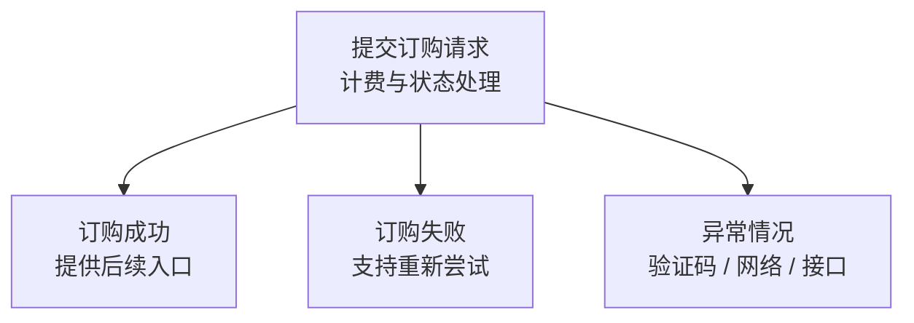

# 02 User Journey

## 用户是怎么完成一次订购的？

这条链路最终转化率的瓶颈不在订购页，而在用户能否在每一步都找到"继续往下走"的理由。我们把它拆成七个阶段，逐一排查流失点。

VybCall Video 的用户并不是主动搜索产品而来，而是在 TikTok、运营商广告或其他合作渠道中第一次接触视频彩铃。相比单纯缩短页面数量，我们更关注每一步用户为什么愿意继续往下走。

---

## 01 广告触达 / Awareness

用户在 TikTok 或其他渠道浏览内容时看到视频彩铃广告，此时对产品几乎没有认知，是否点击主要取决于广告内容本身是否能引起兴趣。

**产品需要解决：** 让广告内容和落地页体验尽量保持一致，避免用户产生明显的跳转割裂感。

## 02 进入 H5 / Landing

用户第一次进入页面时不会花很多时间理解复杂信息。首页需要完成两件事：**让用户快速看到内容，同时知道内容可以被试听和订购。**

## 03 浏览与试听 / Explore

用户浏览推荐的视频彩铃并试听感兴趣的内容。这个阶段不希望过早打断用户，而是先让用户产生对内容本身的兴趣，再决定是否订购。

## 04 产生订购意愿 / Intent

用户找到喜欢的内容并点击订购，这是整个链路里最关键的转折点：用户从"看看内容"变成"我想要这个内容"。此时需要尽量减少额外操作，避免流程复杂导致用户放弃。

## 05 身份验证 / Authentication

这一阶段的设计重点不是增加一个"登录功能"，而是**根据用户所处的网络环境，选择操作成本更低的身份验证方式**。

- **手机网络：** 尽量通过免登录方式完成身份识别，减少手机号输入和验证码操作
- **Wi-Fi 网络：** 输入手机号 → 获取短信验证码 → 输入验证码 → 完成登录

## 06 发起订购 / Subscribe

身份验证完成后，用户确认订购，系统根据业务和计费能力发起请求。页面需要让用户明确知道：自己在订购什么、操作是否已提交、订购是否成功，避免状态不明确导致重复操作或直接离开。

## 07 结果反馈 / Result

不满足于"成功/失败"两分法，把异常情况单独拆出来分类处理，避免统一显示"系统错误"。

这一部分后来也成为设计 Error States 时重点处理的内容。

---

## 我的思考

刚开始看这条链路时，很容易把它理解成一个普通的"内容展示 + 订购"页面。但真正开始做之后，我发现影响转化的并不只有最后的订购按钮。

用户从广告进入页面之后，每一步都可能离开：广告和落地页内容不一致会离开，进入页面后不知道产品是什么会离开，找不到感兴趣的内容会离开，登录步骤太复杂也可能离开，甚至已经完成操作，如果结果反馈不清楚，也会影响整个体验。

所以在这个项目里，我开始更习惯从一条完整的用户链路去看产品，而不是只关注某一个页面。

**每减少一个不必要的操作、每解决一个可能导致用户退出的问题，本质上都在降低这条订购链路的摩擦。**